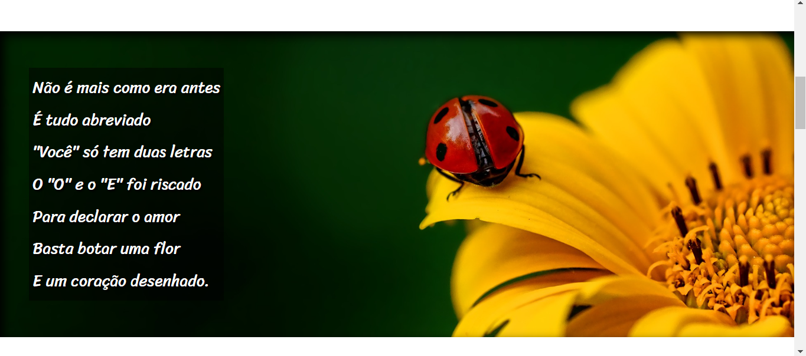

# POEMA CORDEL
👨‍🏫PROJETO FEITO PARA O CURSO DE HTML E CSS DO CURSO EM VIDEO.

 <br>

## DESCRIÇÃO:
Este é um código HTML e CSS para uma página da web chamada "CORDEL". Vamos analisar as principais partes do código:

### HTML (`CODIGO.html`):
1. **Meta Tags e Título:**
   - Define o conjunto de caracteres, a compatibilidade com o Internet Explorer e a configuração da viewport.
   - Define o título da página como "CORDEL".

2. **Vinculação de Estilos e Ícone:**
   - Vincula um arquivo de estilo externo (`../CSS/CODIGO.css`).
   - Define um ícone para a aba do navegador (`../MIDIAS/Cornmanthe3rd-Plex-Other-html-5.ico`).

3. **Cabeçalho (`<header>`):**
   - Inclui um título (`<h1>`) e uma referência ao autor com um link (`<a>`).

4. **Seções (`<section>`):**
   - Contêm o conteúdo do cordel, dividido em seções normais e de imagem.
   - Cada seção contém parágrafos (`<p>`) com versos do cordel.

5. **Rodapé (`<footer>`):**
   - Inclui informações sobre a autoria do site, com um link para o criador.

### CSS (`../CSS/CODIGO.css`):
1. **Resets e Fontes:**
   - Reseta as margens e preenchimentos padrão (`*`).
   - Define várias fontes (`@font-face`) para serem usadas no documento.

2. **Estilos Gerais:**
   - Define o estilo para o corpo e a página, incluindo a cor de fundo, altura mínima da viewport e fonte padrão.
   - Configura o estilo do cabeçalho, incluindo a cor de fundo, cor do texto, e fontes específicas.

3. **Estilos de Link:**
   - Define o estilo para links e links hover, alterando a cor e adicionando um sublinhado no hover.

4. **Estilos das Seções:**
   - Configura o espaçamento e a aparência das seções normais e de imagem.
   - Define estilos específicos para as seções de imagem, incluindo a imagem de fundo, sombra e cor do texto.

5. **Estilos para Elementos Específicos:**
   - Estiliza o cabeçalho `<h1>` dentro do `<header>`.
   - Estiliza o parágrafo dentro das seções de imagem, adicionando fundo e sombra ao texto.

6. **Estilos para Imagens de Fundo (`#img01` e `#img02`):**
   - Configura imagens de fundo específicas para as seções de imagem.

7. **Estilos para o Rodapé:**
   - Define a aparência do rodapé, incluindo cor de fundo, cor do texto e padding.

### CONSIDERAÇÕES ADICIONAIS:
   - O código utiliza diferentes fontes, incluindo "PASSION_BOLD", "PASSION_BLACK", "PASSION_REGULAR" e "SRIRACHA", que devem estar disponíveis nos arquivos de fontes (`../FONTES/`).
   - A página segue um estilo de cordel moderno, com versos que abordam temas contemporâneos.
   - As seções de imagem têm estilos específicos para melhorar a apresentação visual.

## COMO USAR?
* Clone o repositório para o seu sistema local:

```bash
git clone https://github.com/VILHALVA/POEMA-CORDEL.git
```

* Navegue até o diretório do projeto.

```bash
cd POEMA-CORDEL
```

* Descompacte o arquivo ZIP (se você baixou manualmente):

```bash
unzip POEMA-CORDEL.zip
```
* Abra o arquivo `CODIGO.html` em seu navegador de preferência.

## NÃO SABE?
- Entendemos que para manipular arquivos em `HTML`, `CSS` e outras linguagens relacionadas, é necessário possuir conhecimento nessas áreas. Para auxiliar nesse aprendizado, oferecemos cursos gratuitos disponíveis:
* [Curso de HTML e CSS](https://github.com/VILHALVA/CURSO-DE-HTML-E-CSS)
* [Curso de JavaScript](https://github.com/VILHALVA/CURSO-DE-JAVASCRIPT)
* [Confira mais cursos](https://github.com/VILHALVA?tab=repositories&q=+topic:CURSO)

## CREDITOS:
- [PROJETO CRIADO PELO VILHALVA](https://github.com/VILHALVA)


